# Projeto _“Um estudo sobre a relação entre isolamento social e empregabilidade durante o período da pandemia da COVID-19 no estado de São Paulo”_

# Project _“A study on the relationship between social isolation and employability during the pandemic period of COVID-19 in São Paulo (Brazil)”_

# Apresentação

O presente projeto foi originado no contexto das atividades da disciplina de pós-graduação [Ciência e Visualização de Dados em Saúde](https://github.com/datasci4health/home), oferecida no primeiro semestre de 2021, na Unicamp.

## Integrantes

|              Nome             	|   RA   	|                        Especialização                        	|
|:-----------------------------:	|:------:	|:------------------------------------------------------------:	|
| Aline Liz de Faria            	| 226606 	| Nutricionista aluna especial                                 	|
| Carolina Neves Freiria        	| 101825 	| Nutricionista - Doutoranda em gerontologia FCM               	|
| Flavia Noeli de Souza Infante 	| 100061 	| Nutricionista - Doutoranda Saúde da Criança e do adolescente 	|
| Gustavo G. Plensack           	| 155662 	| Engenharia Elétrica - Aluno especial                         	|

# Disclaimer ⚠️
Como você deve ter notado pelas especializações dos integrantes, nós não somos especialistas em economia nem políticas de saúde pública. Este estudo foi conduzido no como um exercício de análise orientada a dados de uma disciplina do programa de pós-graduação da Unicamp e não deve ser usado para nada além deste propósito.

# Acompanhando a Evolução do Projeto
Com o intuito de simplificar a navegação pelas versões do projeto, foram criadas 3 tags, sendo elas E1, E2 e E3. Estas tags correspondem aos commits finais em cada uma das entregas. Para visualizar o trabalho nestes pontos da história, dar checkout nestas tags, como mostra o comando abaixo para a E1:

```sh
git checkout E1
```

Você também pode inspecionar as tags pelo seu navegador usando a seção de [tags](https://github.com/gustavoplensack/datasci4health/tags) do GitHub.


# Descrição Resumida do Projeto
A pandemia da COVID-19 é um acontecimento sem precedentes na história recente da humanidade e seus impactos chegaram a todos os setores da sociedade. Como forma de mitigar a crise sanitária, uma das medidas mais eficazes se mostrou ser o distanciamento social.

Esta prática, necessária para conter os números de casos da COVID-19 pode desencadear mudanças sobre a economia, em especial em países emergentes como o Brasil. Este estudo se propõe a investigar as relações entre o isolamento social praticado no estado de São Paulo, através dos dados do Instituto de Pesquisas Tecnológicas (IPT), e a empregabilidade, através dos dados da  Pesquisa Nacional por Amostra de Domicílios (PNAD) e Cadastro Nacional de Empregados (CAGED).

A análise das séries referentes à empregabilidade no país evidenciou importantes modificações ao longo da pandemia, sendo que o aumento do isolamento correlacionou-se com a redução da empregabilidade. Ressalta-se que apesar da presença de correlação entre empregabilidade e isolamento social, a estatística adotada em nosso estudo não nos permite inferências sobre causa e efeito. O fenômeno da pandemia e empregabilidade é multidimensional e futuras análises devem incorporar  possíveis efeitos mediadores nesta situação como nível de ocupação de UTIs, recebimento de auxílio emergencial e índices econômicos.

**O isolamento social é, e segue sendo, uma das principais formas de reduzir a circulação do vírus e salvar vidas.**


# Vídeos do Projeto
## Vídeo da Proposta
🎥 [Proposta](https://drive.google.com/file/d/1r17x60hF7Gx_e8v6M-6V-O7QfEi8iRQL/view)

## Vídeo da Apresentação Final
🎥 [TBD](tbd)

# Slides do Projeto
## Slides da Proposta
[Proposta do Projeto - CX002A/IA368X](https://docs.google.com/document/d/17sgFU_VSk_p8cTdW3BPgF-Q1Tbr7KLM4GlUjHscx184/edit?usp=sharing) 

## Slides da Apresentação Final
[Apresentação final - CX002A/IA368X](https://docs.google.com/presentation/d/1KfwHWIPRDmZvLer-tZGSdh2pJMqdxvl_slKtDLJ1BuE/edit#slide=id.gb6e7b4d16d_3_21)

# Introdução e Referenciais Teóricos
A pandemia da COVID-19 é um acontecimento sem precedentes na história recente da humanidade e seus impactos chegaram a todos os setores da sociedade. Como forma de mitigar a crise sanitária, uma das medidas mais eficazes se mostrou ser o distanciamento social (de SOUZA, 2020).

Esta prática, necessária para conter os números de casos da COVID-19 pode desencadear mudanças sobre a economia, em especial em países emergentes como o Brasil devido à limitação de circulação de pessoas (MUNIZ, SILVA, FERNANDES, 2020).

A instabilidade na saúde causada pela pandemia da Covid-19, doença causada pelo novo Coronavírus (SARS-CoV-2), acentuou as vulnerabilidades do nosso sistema social econômico, em um país de larga extensão territorial com diversos cenários econômicos como é o Brasil (MUNIZ, SILVA, FERNANDES, 2020).

A primeira notificação de Covid-19 ocorreu em 25 de fevereiro de 2020. Em março do mesmo ano, o país adotou as normas de distanciamento social (quarentena), afetando setores da economia, em especial alimentação, hospedagem e comércio (COSTA, 2020).

Neste contexto, o presente estudo propõe investigar as relações entre o isolamento social praticado no estado de São Paulo e a empregabilidade, através dos dados do IPT, da PNAD e CAGED.

A relevância de verificar tais relações, permite vislumbrar a necessidade de ações para impulsionar o setor econômico  pós pandemia,  como empregabilidade, incentivos fiscais e trabalhistas, assim como medidas de incentivo do setor privado através de linhas de crédito e medidas de incentivo ao consumo.

A motivação do desenvolvimento deste estudo, iniciou-se a partir  da observação da grande demanda dos canais de comunicação em anunciar enfrentamentos no setor de trabalho, como altas taxas de desemprego, aumento da pobreza, e medidas governamentais para conter a crise sanitária e redução dos impactos na economia do país.

No campo científico, alguns autores abordam a questão dos índices de empregabilidade no contexto da pandemia (COSTA, 2020, MUNIZ, SILVA, FERNANDES, 2020). Costa, (2020) relata que fatores anteriores à crise sanitária, como redução do investimento público em programas sociais, e as mudanças na Consolidação das Leis Trabalhistas (CLT) podem ter influenciado os números de desemprego no país.

Nosso estudo se baseou na análise de correlações entre as séries históricas dos dados de empregabilidade e isolamento para o estado de São Paulo. Para isso foram construídos bancos de dados a partir dos dados públicos disponibilizados pelo IPT, Ministério da Economia - Secretaria do Trabalho (ME-ST) e Instituto Brasileiro de Geografia Estatística (IBGE).

Foi encontrado correlação inversamente proporcional do número de ocupados com o isolamento para o estado. Também foi encontrado correlação inversamente proporcional entre os setores da economia e o isolamento praticado no estado. Apesar dos dados gerais do CAGED para o estado não possuírem correlação, a maioria apresentou correlação para o número de admissões e saldo dos Departamentos Regionais de Saúde (DRSs).

# Perguntas de Pesquisa

Qual a relação entre isolamento social e empregabilidade (PNAD e CAGED) durante a pandemia da COVID-19 no estado de São Paulo?

## Hipóteses

**H1:** existe correlação entre isolamento social e empregabilidade no estado de São Paulo.

# Objetivos do Projeto
Investigar as relações entre o isolamento social praticado no estado de São Paulo e a empregabilidade no primeiro ano da pandemia.

## Objetivos Secundários
* Analisar o isolamento social no estado de São Paulo e em seus Departamentos Regionais de Saúde (DRS) entre março de 2020 a março de 2021.
* Analisar as séries históricas do CAGED e PNAD ao longo do primeiro ano da pandemia;
* Analisar a correlação entre entre o isolamento praticado no estado e os diversos setores da atividade econômica representados na PNAD;
* Analisar a correlação entre o isolamento praticado nos DRSs e o CAGED;

# Metodologia
O projeto de pesquisa utilizou o modelo KDDM seguindo a metodologia de Fayyad et al, 1996 dividida em 9 passos:
1. Desenvolvimento do projeto e entendimento do problema; 
2. Criação de conjunto de dados alvo;
3. Limpeza dos dados e Pré-processamento;
4. Redução dos dados e Projeções;
5. Escolha da tarefa de mineração de dados;
6. Escolha do algoritmo para análise dos dados;
7. Mineração dos dados;
8. Interpretação dos dados;
9. Consolidação do conhecimento;

Através destes 9 passos, buscamos estudar como as séries históricas de empregabilidade mensuradas pela CAGED e PNAD Contínua se correlacionam com os dados do isolamento social mensurados pelo IPT para o estado de São Paulo.

A análise dos dados foi baseada na exploração visual das séries, em conjunto com o estudo da correlação usando o método de Spearman, devido à não normalidade das séries. Os detalhes estão na seção análises realizadas.

# Bases de Dados e Evolução

## Bases de Estudadas mas Não Adotadas

### Mapa brasileiro da COVID-19 - InLoco

|             Base de Dados            |                 Endereço na Web                 |                                      Resumo descritivo                                     |
|:------------------------------------:|:-----------------------------------------------:|:------------------------------------------------------------------------------------------:|
| Mapa brasileiro da COVID-19 - InLoco | https://mapabrasileirodacovid.inloco.com.br/pt/ | Dados de abrangência nacional sobre isolamento social coletado através de apps de celular. |

A InLoco é uma startup de Recife especialista em geolocalização (atuante desde 2011). Para criar o “Índice de isolamento social” a Inloco utilizou dados celulares de 60 milhões de usuários. Por meio da API (Application Programming Interface) de aproximadamente 600 aplicativos (desde aplicativos de bancos até lojas de varejo) parceiros da empresa que anonimiza e agrega os dados e então repassa aos estados parceiros. A InLoco coletava, até então, estes dados de geolocalização para fins de publicidade e prevenção de fraudes. Durante a pandemia estes dados foram utilizados para avaliar o isolamento social.

A empresa calcula a taxa de isolamento a partir de um espaço que é dividido em polígonos de 450 metros de raio. A taxa de isolamento mede, do total de aparelhos que estavam no polígono durante a noite, quantos não mudaram de polígono ao longo do dia. A taxa de precisão é de 3 metros.

Para essa análise ser estatisticamente relevante, são disponibilizados os dados de isolamento apenas no caso de haver um número mínimo de 20 usuários observados dentro das microrregiões. Se um município não tiver nenhuma microrregião que atenda a esse filtro, ele é desconsiderado e será eliminado na composição do Índice de Isolamento do Estado.

Durante o segundo semestre de 2020, a empresa InLoco foi vendida para a rede Magazine Luiza e a coleta de dados foi descontinuada no início de 2021. Os dados coletados durante o ano de 2020 e início de 2021 ficarão disponíveis no Tableau Public. Foram coletados dados durante o período de fevereiro de 2020 até março de 2021.

Após a reunião com a professora Thaís na E1 o grupo acatou a sugestão de trabalhar com dados em menores proporções e limitamos o trabalho ao estado de São Paulo, o que nos permitiu descartar este conjunto de dados. Outros motivos para não escolhermos os dados do Inloco foi a descontinuidade da coleta a partir do final de março de 2021 e o fato de terem sido coletados por meio de apps específicos, o que pode enviesar as análises, uma vez que estaríamos considerando apenas o isolamento dos usuários de alguns apps.

### Pesquisa Nacional de Amostras de Domicílios - PNAD COVID-19

| Base de Dados |                                                                                            Endereço na WEB                                                                                            |                                       Resumo Descritivo                                       |
|:-------------:|:-----------------------------------------------------------------------------------------------------------------------------------------------------------------------------------------------------:|:---------------------------------------------------------------------------------------------:|
|   PNAD COVID-19  | https://www.ibge.gov.br/estatisticas/investigacoes-experimentais/estatisticas-experimentais/27946-divulgacao-semanal-pnadcovid1?t=o-que-e&utm_source=covid19&utm_medium=hotsite&utm_campaign=covid_19 | Dados de abrangência nacional com entrevistas realizadas pelo telefone com 193 mil domicílios |

Durante a pandemia também foi lançada a PNAD COVID-19 que acompanhou 193,6 mil domicílios em 3.364 municípios do país com o objetivo de avaliar os impactos da pandemia no mercado de trabalho.

Era composta por um questionário dividido em duas partes: a primeira composta por perguntas sobre saúde, especificamente sobre sintomas relacionados a COVID19 e a segunda parte sobre trabalho e se houve recebimento de auxílios por parte do governo, como auxílio emergencial, bolsa família, seguro desemprego, benefício de prestação continuada (BPC), lei orgânica da previdência social (LOAS) e aluguel.

Teve seu início em maio de 2020 e foi descontinuada em setembro do mesmo ano. Por este motivo, visando atender aos objetivos estabelecidos neste projeto de pesquisa, optou-se pela análise apenas da PNAD contínua que abrange um período maior de estudo. Além disso, a PNAD covid-19, segundo o próprio IBGE, pode fornecer estatísticas experimentais na quais as inferências realizadas a partir dos dados devem ser realizadas com maior cautela (IBGE, s/d).


## Bases Estudadas e Adotadas

### Dados de Isolamento Social do Estado de São Paulo - IPT

|                      Base de Dados                      |                    Endereço na Web                    |                                  Resumo descritivo                                 |
|:-------------------------------------------------------:|:-----------------------------------------------------:|:----------------------------------------------------------------------------------:|
| Dados de Isolamento Social do Estado de São Paulo - IPT | https://www.saopaulo.sp.gov.br/coronavirus/isolamento | Dados sobre o isolamento social em cidades paulistas com mais de 50 mil habitantes |

O IPT juntamente com o SIMI-SP (Sistema de Informações e Monitoramento Inteligente do Governo do Estado de São Paulo) divulga, diariamente, dados sobre o isolamento social nas cidades do estado de São Paulo. Os dados sobre isolamento social são coletados a partir de empresas prestadoras de serviços de telecomunicação (telefonia celular – VIVO, TIM, CLARO, OI). Tais dados são obtidos a partir de uma plataforma chamada Big Data que é gerida pela Associação Brasileira de Recursos em Telecomunicações (ABR Telecom).

O índice de isolamento social é baseado na localização obtida pelas antenas de celulares, usando como local de referência a localização onde o celular permaneceu entre 22h00 e 2h00. Um celular que tenha se afastado desta referência, mais de 200m, é considerado fora do isolamento.

Os dados são repassados de forma anônima e agregada índices, gráficos e mapas estaduais agregados por municípios, não existindo a possibilidade de acesso a qualquer dado individualizado por parte do IPT ou do Governo do Estado.

No início da coleta dos dados (início da pandemia) eram repassados apenas dados de municípios que possuíam mais de 70.000 habitantes, no entanto, a partir de janeiro de 2021 foram incluídos municípios com mais de 50.000 habitantes. Os índices são disponibilizados de maneira pública no [site do estado](http://saopaulo.sp.gov.br/coronavirus/isolamento) e são atualizados diariamente.

O esquema do banco é uma série temporal com o isolamento naquele dia para um dado município. Também são encontrados alguns metadados como a população em 2020 e código do IBGE.

Os dados divulgados pelo IPT apresentavam alguns pouquíssimos dados faltantes nos primeiros dias de análises (fevereiro e março) para alguns municípios usados na elaboração do banco de dados sobre isolamento social. Para as análises propostas, foram realizadas médias para avaliar as correlações e eles foram ignorados.

Uma análise inicial sobre estes dados permitiu notar que para as 20 cidades mais populosas do estado a série de isolamento apresenta uma alta correlação. Ao longo de todo o período, o isolamento ficou entre 30% e 50% sendo um pouco maior nos finais de semana. Detalhes, gráficos e código podem ser verificados em [notebooks/Estudo_IPT_E2.ipynb](https://github.com/gustavoplensack/datasci4health/blob/main/notebooks/Estudo_IPT_E2.ipynb)
 
Entendemos estes dados como sendo melhores do que os dados do InLoco, devido ao fato de estes serem associados a todos os usuários de dispositivos móveis que se locomoveram, sendo assim menos restrito ao tipo de usuário.

### PNAD contínua - Macrodados

|          Base de Dados          |                                                                      Endereço na Web                                                                      |                                                       Resumo descritivo                                                      |
|:-------------------------------:|:---------------------------------------------------------------------------------------------------------------------------------------------------------:|:----------------------------------------------------------------------------------------------------------------------------:|
| Macrodados PNAD Contínua - IBGE | https://www.ibge.gov.br/estatisticas/sociais/trabalho/9173-pesquisa-nacional-por-amostra-de-domicilios-continua-trimestral.html?edicao=30227&t=resultados | Acompanhamento do desenvolvimento socioeconômico do país, apresentando dados referente a força de trabalho formal e informal |

A Pesquisa Nacional por Amostras de Domicílios (PNAD) em sua forma contínua teve início em 2012 com a junção da PNAD antiga e a Pesquisa Mensal de Emprego (PME) sendo realizada pelo Instituto Brasileiro de Geografia e Estatística (IBGE). A pesquisa tem abrangência nacional possibilitando inferências sobre o país, grandes regiões, unidades da federação e de algumas regiões metropolitanas dos municípios das capitais (SULIANO, 2017; IBGE, s/d).

O grande foco da PNAD é o acompanhamento do desenvolvimento socioeconômico do país, apresentando dados referente a força de trabalho tanto formal como informal de forma mensal (país) e trimestral (demais subdivisões), contemplando outras informações relevantes de forma anual, sendo para tanto considerada uma das principais pesquisas sobre o mercado de trabalho do Brasil (SULIANO, 2017; IBGE, s/d; CONSEUIL, et al., 2019).

A pesquisa é realizada em 3.500 municípios do Brasil, acompanhando em média 211.344 domicílios particulares permanentes, na qual, cada um dos domicílios é visitado por 5 trimestres consecutivos. Durante o período da pandemia pelo coronavírus as entrevistas estão sendo realizadas via telefone (início na terceira semana de referência do mês de março de 2020) (SULIANO, 2017; IBGE, s/da; IPEA, 2019).

O acesso ao banco de dados é aberto e fica localizado no próprio site do IBGE. No site é possível o acesso rápido às informações mensais do país e aos dados trimestrais das regiões e unidades da federação. Para as análises referentes às regiões metropolitanas dos municípios das capitais é necessário o acesso aos microdados da pesquisa (IBGE, s/da).
 
**Sobre os dados utilizados da PNAD contínua**

Após a primeira arguição de nosso projeto com a professora Thaís, optou-se por focar apenas no banco de dados referente ao estado de São Paulo. Pelo site do IBGE foi possível baixar o banco de dados brutos do estado, com 112 tabelas contendo informações sobre a população geral, força de trabalho e rendimentos obtidos entre o período de janeiro de 2012 a dezembro de 2020.

Inicialmente foi realizado um recorte temporal do banco, considerando o último trimestre pré-pandemia (outubro/dezembro 2019) e o período referente a pandemia de covid-19 no país (considerando os trimestres de janeiro/março a outubro/dezembro de 2020). Após, foram coletadas as informações referentes a população total; população com mais de 14 anos de idade; pessoas de 14 anos ou mais de idade ocupadas; pessoas de 14 anos ou mais de idade desocupadas e pessoas de 14 anos ou mais de idade fora da força de trabalho. A seleção destas informações foi realizada para o estabelecimento de um panorama acerca da situação de pessoas empregadas, desempregadas e que estavam fora da força de trabalho (não estavam em busca de emprego) durante o período da pandemia. Não foi necessário lidar com dados faltantes.

### CAGED - ME-ST
| Base de Dados |                       Endereço na Web                       |                            Resumo descritivo                            |
|:-------------:|:-----------------------------------------------------------:|:-----------------------------------------------------------------------:|
| CAGED - ME-ST | https://www.gov.br/trabalho/pt-br/assuntos/empregador/caged | Dados sobre empregados contratados e demitidos seguindo o regime da CLT |

O Cadastro Geral de Empregados e Desempregados (Caged), é um Registro Administrativo, derivado do cumprimento de obrigação trabalhista definida pela Lei nº 4.923, de 23 de dezembro de 1965, de periodicidade mensal, cujo objetivo é monitorar a evolução do mercado de trabalho formal. Os dados estatísticos do Caged são obtidos a partir de declarações enviadas mensalmente pelos estabelecimentos, que dizem respeito à movimentação de empregados ao longo do mês (MINISTÉRIO da ECONOMIA, 2020).

A declaração do Caged é obrigatória para todo estabelecimento, privado ou público, que tenha admitido, desligado ou transferido empregado com contrato de trabalho regido pela Consolidação das Leis do Trabalho (CLT). Seu universo de abrangência  limita-se aos empregados formais celetistas, incluindo contratos de trabalho com prazo indeterminado e determinado, aprendizes, trabalhadores intermitentes, por tempo parcial e temporários (para estes últimos, a declaração é opcional). Não estão incluídos no Caged servidores da administração pública direta ou indireta, federal, estadual ou municipal, trabalhadores, autônomos e trabalhadores informais (MINISTÉRIO da ECONOMIA, 2020).

Originalmente criado para fins operacionais, o Caged constitui hoje uma das principais fontes de informações estatísticas sobre o mercado de trabalho conjuntural formal, sendo amplamente utilizado por órgãos governamentais, centros de pesquisa, consultorias privadas e academia. Sua base de dados inclui informações sobre os vínculos formais, informações individuais dos trabalhadores, além de características dos estabelecimentos, sendo a única fonte de informação sobre emprego formal mensal.  (MINISTÉRIO da ECONOMIA, 2020).

Após arguição com a professora Thaís o grupo, preferiu investigar dados menores, e limitamos o trabalho ao estado de São Paulo. No entanto, como apontado na reportagem do Jornal Nacional intitulada: ["Pesquisas sobre nível de emprego podem ter deixado de apresentar retrato preciso do mercado de trabalho, dizem especialistas"](https://globoplay.globo.com/v/9479568/), os dados do CAGED podem ter deixado de refletir a situação do desemprego em conjunto com a PNAD.

Não houveram dados faltantes para o período da pandemia.

## Integração entre Bases e Análise Exploratória

A integração entre as bases de dados se deu seguindo três agrupamentos: o temporal, o regional e por setor da atividade econômica. Para isso, aplicamos os seguintes passos:

**1.** Os dados do CAGED são amostrados por meses, os dados da PNAD são amostrados por trimestres já os dados do IPT são amostrados por dia. Para colocar todos em uma base comum para análise, todos os dados foram convertidos para a escala de meses.

**a.** Os dados trimestrais da PNAD foram repetidos para os meses que compunham o trimestre;

**b.** Os dados do CAGED não precisaram ser alterados, uma vez que já estavam na base temporal desejada;

**c.** Os dados diários do IPT foram agrupados mensalmente por meio de uma média para o isolamento dos dias observados;

**2.** Do ponto de vista de agrupamento regional, os dados também possuem granularidades distintas, a PNAD apenas para todo o estado, CAGED para todos os municípios e IPT apenas para os municípios elegíveis (mais de 50 mil habitantes). Para atendermos nossas hipóteses:

**a.** A PNAD foi considerada apenas para análises para todo o estado em conjunto com os dados do IPT;

**b.** CAGED e IPT foram agrupados de acordo com os DRSs do estado, de modo a tentar capturar comportamentos similares no que diz respeito aos decretos das fases do Plano São Paulo de combate ao Coronavírus. Para ver como foi feito este agrupamento, veja o [Anexo I](assets/pdf/ANEXO-I.pdf).

**3.** A análise pelo setor da atividade econômica pode ser feita apenas pela PNAD quando comparada ao isolamento social para o estado. O CAGED não pode ser usado nesta análise, pois não possui tal granularidade.

Com estes agrupamentos buscamos analisar e estudar os objetivos descritos no início deste repositório.

# Análises Realizadas
Para realizar as análises, foi de fundamental importância compreender os dados à priori. Esta tarefa demandou grande parte do tempo para desenvolver este projeto. Cabe ressaltar que a utilização de dados, estão disponíveis nos endereços já citados nos itens anteriores e que estão disponíveis para consulta. Assim, foram consultados, notas técnicas oficiais, páginas da web, artigos, para melhor clareza no entendimento. Cada base de dados utilizada possui sua própria metodologia e formas diferentes de descrição das informações.

Para concretizar as análises e ser possível verificar as possíveis relações entre os dados, foram debatidos vários caminhos.

**1.** Na primeira etapa do projeto a intenção era investigar os mesmo dados porém, em macrorregiões e para todo o Brasil, após arguição da primeira etapa, foi sugerido pelo professor avaliador, que de início fosse apenas uma região. 

**2.** Foi decidido o ajuste da investigação para o estado de São Paulo. Porém, a extensão territorial ainda era complexa, uma vez que o estado possui 645 municípios, dos quais apenas 139 possuem mais de 50.000 habitantes segundo o IPT;

**3.** O IPT avalia e apresenta dados do isolamento social do estado diariamente, desde fevereiro de 2020. São apresentados dados de 139 municípios e um referente ao estado. O isolamento social realizado no estado de São Paulo sofre a influência  das imposições do Plano São Paulo. Neste plano, o estado está dividido em 17 DRSs, que são categorizados segundo uma escala de cinco níveis de abertura econômica (mais rígido a mais brando). A indicação dos níveis está associada principalmente à taxa de ocupação dos leitos de UTI-Covid e a incidência de casos. Para realizar as análises, os municípios constantes no IPT foram agrupados seguindo os DRSs, uma vez que os decretos estaduais sugerem flexibilizar ou restringir a circulação de pessoas nessas regiões. A descrição destes DRSs está no Anexo I.

**4.** Os macro dados da PNAD são fornecidos de forma trimestral para o estado como um todo e setores das atividades econômicas. Para ter a amostragem mensal, os dados foram repetidos para os meses que compunham o trimestre;

**5.** O CAGED apresenta mensalmente dados sobre a empregabilidade para cada um dos municípios do país apresentando 4 informações: admissões, demissões, saldo (diferença entre admissões e demissões) e estoque (diferença entre o mês anterior e o mês atual do total de trabalhadores empregados). Ele fornece estes dados, pela divisão de estados no território nacional ao longo do tempo; Foram considerados os dados referentes ao estado de São Paulo assim como os dados médios de admissão e saldo de cada DRSs no período de fevereiro de 2020 a março de 2021.

**6.** Todos os dados quantitativos passaram pelo teste de Shapiro-Wilk para avaliar a sua normalidade e como a grande maioria não apresentou distribuições normais `(p>0,05)`, optou-se pelo teste de correlação não-paramétrico de Spearman. Consideramos valores inferiores à `0,5` como baixa correlação, de `0,5` à `0,7` como moderada e acima de `0,7` como forte. O nível de significância adotado para as análises foi de `p<0,05`.

# Ferramentas

As ferramentas utilizadas dentro deste projeto são:

* Python 3.6.9 e suas bibliotecas (veja o requirements.txt);
* Orange;
* Stata;
* Gerenciamento de planilhas:
    * MS Excel;
    * Google Sheets;
* Armazenagem e Computação em Nuvem:
    * Google Drive;
    * Google Colab;
* Git;

Estas foram usadas pois eram as ferramentas que o grupo conhecia, tinha acesso e eram capazes de serem usadas para realizar as análises desejadas.

# Resultados e Discussão

## Dados IPT

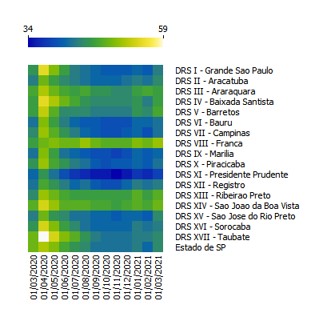

**Gráfico 1:** Isolamento social no estado de São Paulo, segundo DRS, entre Março de 2020 a Março de 2021.

O Gráfico 1 apresenta a média de isolamento social, segundo os DRSs do estado de São Paulo entre Março/2020 até Março/2021. As cores verde e amarela indicam os maiores valores de isolamento e a tonalidade em azul indicam os menores valores de isolamento social. Pode-se perceber que nos meses de Abril e Maio foram os períodos onde se obteve os maiores valores para isolamento social em todos os DRSs, com todos os DRSs em tonalidade de verde e amarelo. A partir destes meses o isolamento social variou muito nos DRSs.

A DRS de Taubaté, que aparece em branco no gráfico, foi onde se obteve o maior índice de isolamento social durante todo o período analisado, com valores próximos a 60% de isolamento social no mês de Abril/2020.

Nos meses de Março e Abril de 2020 foram publicados decretos e portarias que visavam o controle da propagação do vírus, o que incluía o fechamento de serviços não essenciais e limitava a circulação da população. Isso levou a um aumento do indicador de isolamento social. Após estes dois meses, mesmo com orientações para a redução da circulação da população e o estímulo ao isolamento social por parte do governo do estado de São Paulo, os números de isolamento começaram a cair com predominância de cor azul no gráfico. Percebe-se que nos meses analisados, alguns DRSs como Franca, Ribeirão Preto e São João da Boa Vista mantiveram valores constantes e mais elevados de isolamento, ao se comparar com outros DRSs.

Em Junho de 2020, em uma tentativa de retomada da economia, o governo do estado de São Paulo lançou o Plano São Paulo em que os DRSs seguiriam medidas de circulação da população e abertura da economia de formas diferentes, e as medidas estariam vinculadas às condições de saúde do DRS.

O Plano São Paulo, do governo estadual, classificou e ainda classifica cada um dos DRSs em 5 níveis: vermelho, laranja, amarelo, verde e azul, sendo a vermelha a situação mais crítica e azul o nível menos crítico. Essa classificação leva em consideração diversos fatores, dentre eles, a capacidade de ocupação dos leitos de hospitais e a taxa de contaminados pela Covid-19. À medida que a ocupação dos leitos e o número de contaminados se eleva, essa classificação tende para o vermelho. Sendo assim, era esperado que a partir de então os DRSs apresentassem níveis de isolamento social diferentes entre si, como observado no Gráfico 1. Apesar desta medida individualizar os DRSs, em alguns momentos, ao longo da série temporal analisada, todos os DRSs encontravam-se em níveis laranja e/ou vermelho - como no mês de Julho/2020 - e ainda assim o nível de isolamento social não se elevou. O Plano São Paulo emitia boletins epidemiológicos à medida que a situação de saúde mudava e também reclassificava cada um dos DRSs. Vale destacar que os prefeitos dos municípios tinham autonomia para tornar as medidas mais rígidas em suas regiões, caso achassem necessário. Visto isso, consideramos relevante analisar os dados de isolamento social não apenas do estado de São Paulo, mas a taxa de isolamento social dos DRSs.

A Organização Mundial de Saúde (OMS) indica como aceitável uma taxa de isolamento social de 50%, e como ideal a taxa de 70% para o controle da doença (WHO, 2020). Houveram momentos e até dias seguidos em que vários municípios atingiram estes valores, mas a média indica que o valor de 70% nunca foi alcançado nos meses analisados. Os indicadores de 50% foram obtidos em alguns momentos, como no início da pandemia, mas em momentos em que a taxa de transmissão estava elevada, como nos meses de julho, o isolamento social não apresentou um crescimento para a maioria dos DRSs. Em nenhum momento, da fase temporal analisada, houve um decreto de lockdown estadual mesmo em situações extremamente graves, com ocupação de mais de 90% dos leitos de UTI - Covid para a maioria dos DRS. Vale salientar que medidas como essa, apesar de necessárias do ponto de vista de saúde, trazem impactos negativos significativos à economia. 

## Dados CAGED

Conforme discutido anteriormente, como os dados de isolamento social sofrem influência dos decretos do Plano São Paulo e este reúne os municípios em 17 DRSs, os dados de isolamento social são apresentados desta forma. Portanto os dados do CAGED também foram organizados segundo os 17 DRSs. O Gráfico 2  representa o valor do número de admissões e demissões  no estado de São Paulo.

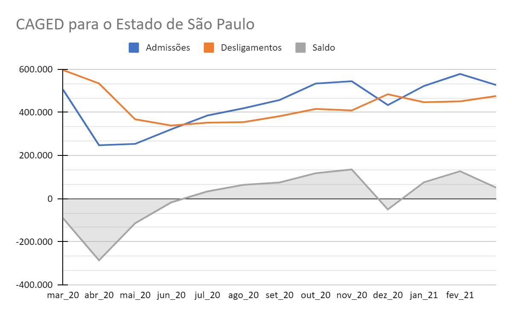

**Gráfico 2** - Dados Caged: número de admissões, desligamentos e saldo do estado de SP.

Foi  possível observar que no início da pandemia entre  os meses de março, abril e maio de 2020, houve uma queda no número de admissões. Já no período que compreende o mês de junho a novembro do mesmo ano o gráfico demonstra melhora. No mês seguinte observou novamente queda.  No início do ano de 2021 houve melhora nas admissões e saldo com discreta ascensão nos meses de Janeiro e Fevereiro.

Os três primeiros meses da pandemia foram caracterizados com perdas no trabalho formal. Cabe ressaltar que além da queda, o isolamento social também dificultava a busca por trabalho, uma vez  que as leis sanitárias estavam sem flexibilização, para conter os casos da COVID-19.

A partir de junho foi implementada pelo estado a abertura da economia, que como comentado na seção do isolamento considera a pluralidade na flexibilização, onde cada município do estado adotou sua regra, que variava de acordo com o número de novos casos da COVID e  número de leitos disponíveis.

O Gráfico 3  demonstra o número de admissões no estado de SP e seus DRSs.  Para compreensão do gráfico, os tons de verde (maior intensidade)  significam maiores admissões, à medida que os tons vão clareando (amarelo) sinaliza diminuição nas taxas de admissões, a cor vermelha indica o período mais crítico com menores valores.

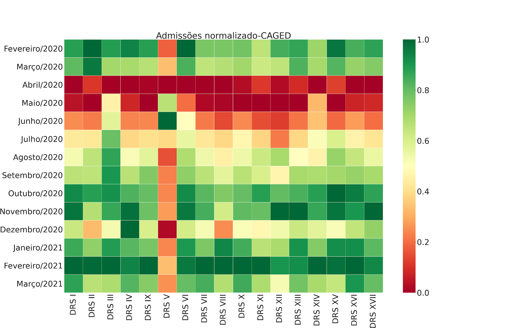

**Gráfico 3** - Número de admissões de acordo com as regiões dos DRSs do estado SP no período  entre fevereiro de 2020 a março de 2021.

Foi possível observar que no período pré-pandemia apenas o DRS V demonstrava instabilidade no setor de empregos formais, porém cabe ressaltar que entre as regiões dos DRSs VII  e XI, já era sinalizado uma diminuição das admissões. Isto sugere que a crise no setor de empregos já apresentava instabilidade, e que a pandemia, apenas intensificou o cenário. Visto que o gráfico ao ser analisado nos meses seguintes, março, abril, maio e junho de 2020, demonstra o período mais crítico (início da pandemia) no qual as leis sanitárias eram mais rigorosas para conter a pandemia da Covid- 19. No terceiro trimestre de 2020, prevaleceram  os tons de amarelo em todos os DRSs, o que demonstrou que na segunda metade do ano a crise no setor apenas aumentava. Neste período, cabe contextualizar que a medida  governamental  como o benefício do  Auxílio Emergencial, pode ter influenciado para que os índices de admissão não aumentassem.

Nos meses de outubro e novembro observou-se uma melhora em todo o estado, uma vez que o plano São Paulo de incentivo à economia  já estava em vigor. O mês de dezembro novamente apresenta uma queda. Neste período de fim de ano é comum que alguns setores, principalmente o comércio, tenham vagas temporárias, e que os contratos sejam finalizados, no último dia do ano. Tal parecer pode ser um indicativo na queda de empregos formais.

O Gráfico 4 apresenta os valores de saldo do estado de SP em seus DRSs no período fevereiro 2020 a março de 2021.

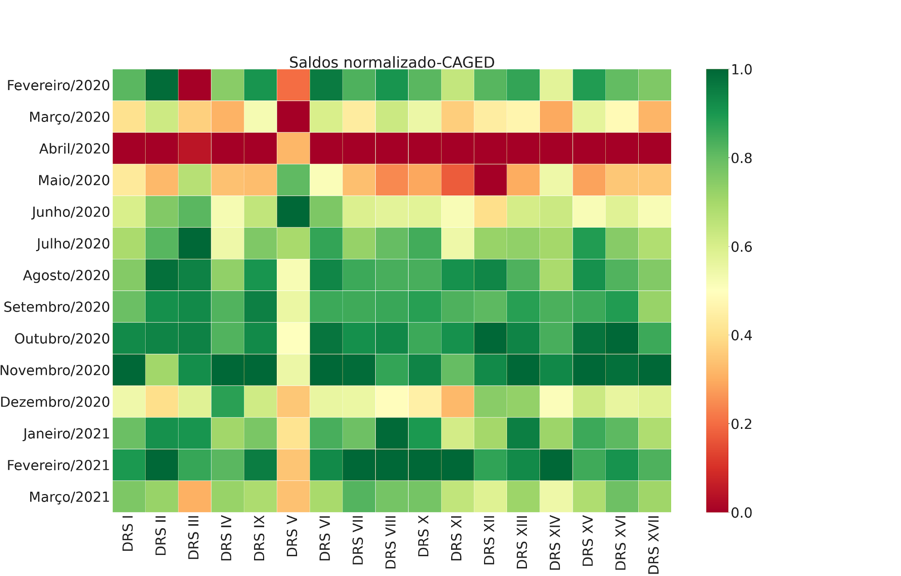

**Gráfico 4** - Valores do saldo segundo o índice Caged no estado de SP, durante o período fevereiro 2020 a março de 2021.

O gráfico demonstra que em relação ao saldo de empregos do estado de SP nos DRSs do mesmo, o mês mais crítico em toda expansão territorial foi o mês de abril, segundo mês da pandemia. Com discreta melhora nos dois meses subsequentes.

De setembro a novembro os saldos em todas as regiões de uma maneira geral se mantiveram estáveis. Em dezembro, o gráfico demonstra perdas, o que corrobora com o Gráfico 3, em relação à queda do mês vigente.

O Gráfico 5 corresponde a taxa de desligamento do índice Caged dividido nos DRSs, em congruência aos resultados anteriores. O início da pandemia se mostrou o mais crítico em relação a perdas de trabalho formal. O que se destaca neste gráfico é que próximo a março de 2020 todo o estado apresenta a maior taxa de desligamento. Este dado pode ter sido agravado também com a diminuição do valor do auxílio emergencial no final do ano, reduzindo a demanda de trabalho formal.


**Gráfico 5** - Taxa de desligamento Caged dividido pelos DRSs, no período de fevereiro de 2020 a março de 2021.

## Dados PNAD

Durante o período selecionado a pesquisa contou com uma amostra de 46 mil pessoas, sendo que destas, aproximadamente 38,5 mil apresentavam 14 anos ou mais de idade, compondo a força de trabalho. O Gráfico 6 contém as informações sobre a população de pessoas de 14 anos ou mais de idade ocupadas, desocupadas e fora da força de trabalho no estado de São Paulo para o período analisado.
 
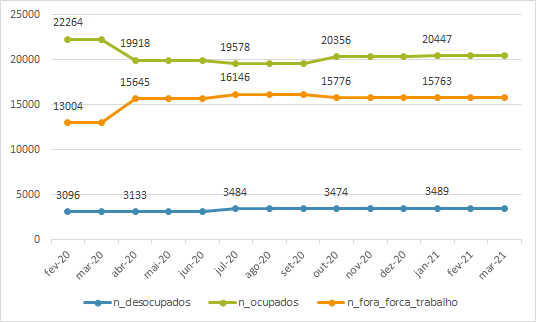

**Gráfico 6** - Número de ocupados, desocupados e fora da força de trabalho no estado de São Paulo - PNAD

No Gráfico 6, a partir do mês de abril nota-se uma clara redução no número de pessoas ocupadas com um crescimento inversamente proporcional ao número de pessoas fora da força de trabalho, enquanto o número de desocupados mostra-se mais estável. Este dado evidencia que principalmente nestes primeiros meses, as pessoas que antes eram ocupadas ao invés de se encaixarem no grupo de desocupadas foram classificadas fora da força de trabalho. Algumas hipóteses para este fenômeno são: medo da pandemia, recebimento de auxílios governamentais (como Auxílio Emergencial), inexistência de vagas de empregos em suas cidades, ou por não terem onde deixar seus filhos durante o expediente de trabalho, as pessoas que perderam seus empregos não estavam na procura por novos, e para tanto não foram consideradas como desocupadas, fato este também observados na literatura por  Mattei e Heinen (2020). 

No último trimestre de 2020, observa-se um aumento no número de ocupados, redução do número de pessoas fora da força de trabalho assim como no número de pessoas desocupadas, o que deu-se principalmente a uma redução dos níveis de transmissão do vírus, redução dos internados e abrandamento da fase do Plano SP na maioria dos DRSs do estado. Nota-se, porém, que no primeiro trimestre de 2021, houve um aumento do número de pessoas ocupadas, redução do número de pessoas fora da força de trabalho e aumento do número de pessoas desocupadas. Este aumento do número de pessoas desocupadas no primeiro trimestre pode ser em decorrência de um aumento das pessoas procurando emprego pós final de ano, tendência esta já observada em outras séries históricas ou até mesmo em decorrência de que neste período  o auxílio emergencial foi reduzido de forma significativa, o que fez com que os beneficiários do auxílio emergencial buscassem novas fontes de renda, muitas com quase-trabalhos, caracterizado pelo recebimento abaixo do salário mínimo e de forma instável (SIQUEIRA, et al., 2021).

A questão sobre empregos formais e informais durante a pandemia, pode ser observada em destaque no Gráfico 7, no qual é retratado a evolução do número de empregos no setor privado  formais e informais e a relação com o nível de isolamento social praticado no estado.

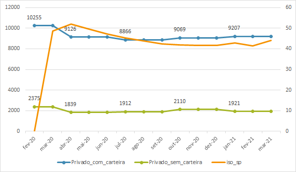

**Gráfico 7** - Número de empregos formais e informais no setor privado e o nível de isolamento no estado de São Paulo

Como podemos observar no Gráfico 7, apesar de inicialmente ambas as séries de  empregos formais e informais apresentarem queda no segundo semestre de 2020, após este momento apresentam diferente evolução o que reflete até mesmo no nível de correlação apresentado com o isolamento social no estado, que pode ser constatado na Tabela 1. 

**Tabela 1** - Correlação entre nível de isolamento e trabalhos formais e informais no setor privado do estado de SP

|               | Emprego formal |        | Emprego informal |         |
|:-------------:|:--------------:|:------:|:----------------:|:-------:|
|               |       R        |    p   |         R        |    p    |
| Isolamento SP |     -0.0090    | 0.9757 |      -0.6272     | 0.0164  |

Enquanto a série de empregos formais, apresenta aumento seguido nos meses seguintes, a série relacionada aos empregos informais apresenta uma variação, com aumento do número de empregos no terceiro e quarto trimestre e redução no primeiro trimestre de 2021. Uma das hipóteses é de que com o aumento do isolamento social nos meses de janeiro e março de 2021, houve uma redução do número de trabalhadores informais, o que refletiu nos números da PNAD para este trimestre.

Destaca-se que nos últimos anos o setor informal que vinha crescendo significativamente,  respondendo antes da crise, por aproximadamente 40% dos empregos no país, foi o setor que  apresentou maior retração, e por consequência maior número de demissões no país durante a pandemia [C.f. Nexus, notícias  28/01/2021]. 

## Ocupados PNAD vs. Isolamento
Uma das primeiras análises que fizemos comparando os dados de PNAD com os dados de isolamento para o estado de SP foi a análise de correlação entre estas séries. Os resultados da correlação podem ser observados na Tabela 2.

**Tabela 2** - Estudo de correlação usando métodos de Spearman e p-valor associando a taxa de Isolamento Social no Estado de SP e PNAD.

| -                          | Desocupados        | Ocupados           | Fora da Força de Trabalho | Isolamento no Estado de SP |
|----------------------------|--------------------|--------------------|---------------------------|----------------------------|
| Desocupados                | 1                  | -                  | -                         | -                          |
| Ocupados                   | -0,6000 (p=0,0085) | 1                  | -                         | -                          |
| Fora da Força de Trabalho  | 0,8286 (p=0,0000)  | -0,8286 (p=0,0000) | 1                         |                            |
| Isolamento no Estado de SP | -0,3833 (p=0,1164) | -0,6748 (p=0,0021) | 0,3833 (p=0,1164)         | 1                          |

Buscando analisar visualmente as séries com maior correlação em um mesmo gráfico, implementamos o Gráfico 8, que apresenta as séries históricas de ocupados e isolamento para todo o estado de SP. 

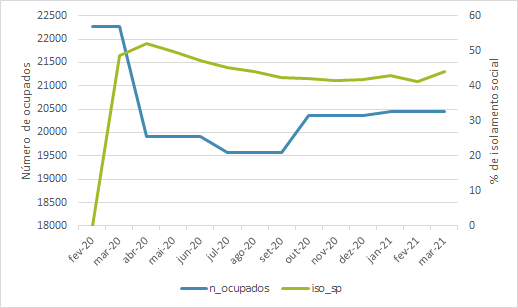

**Gráfico 8** - Isolamento Social e Número de Ocupados para o Estado de São Paulo no período analisado.

Analisando o gráfico e a informação sobre a correlação entre as séries, é possível notar uma redução no número de ocupados nos primeiros meses da pandemia no estado de São Paulo, acompanhado de uma leve melhora à medida que o isolamento diminui nos meses finais do ano. É possível notar que o aumento do isolamento social está correlacionado com a redução da ocupação. Na análise da correlação entre as séries da PNAD, também é possível notar que a redução da ocupação está correlacionada aos aumentos de pessoas fora da força e desocupadas.

## Total Admissão e Saldo CAGED vs. Isolamento
Repetindo o que fora aplicado para a PNAD, aplicamos ao CAGED uma análise de correlação das principais séries históricas com os dados do isolamento no estado de SP. Foram considerados o total de admissões, total de desligamentos e saldo. Como demonstra a Tabela 3.

**Tabela 3** - Estudo de correlação usando métodos de Spearman e p-valor associado para CAGED e Taxa de Isolamento Social no Estado de SP.

| -                          | Total de Admissões | Total de Desligamentos | Saldo              | Isolamento no Estado de SP |
|----------------------------|--------------------|------------------------|--------------------|----------------------------|
| Total de Admissões         | 1                  | -                      | -                  | -                          |
| Total de Desligamentos     | 0,4176 (p=0,1075)  | 1                      | -                  | -                          |
| Saldo                      | 0,8324 (p=0,0001)  | -0,0471 (p=0,8286)     | 1                  |                            |
| Isolamento no Estado de SP | -0,3833 (p=0,1164) | 0,0354 (p=0,8964)      | -0,3864 (p=0,1393) | 1                          |

Entre CAGED e IPT não foi possível observar nenhuma correlação mais forte nem com p-valor significativo.

## PNAD dados por setor econômico vs. Isolamento do estado

A Tabela 4 apresenta os valores de correlação obtidos entre o número de ocupados pelos diferentes setores da economia e a porcentagem de isolamento social no estado de SP.  Percebe-se que entre todos os setores, o único que apresentou forte correlação com o isolamento social foi o de comércio `(R: -0.80; p:<0.001)`. Também foram observadas correlações moderadas entre isolamento e os setores da indústria, construção, alimentação/hospedagem, informação e comunicação. 

**Tabela 4** - Correlação entre o número de empregos dos diferentes setores da PNAD com o isolamento social do estado de São Paulo (fevereiro de 2020 a março de 2021).

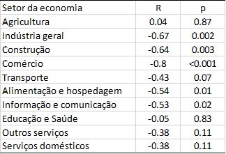

Entre os que não apresentaram correlações significativas com o isolamento podemos destacar os setores da agricultura e da educação/saúde. No caso do setor da agricultura e pecuária, foi um dos únicos setores que não apresentou inflexão com a pandemia visto que não teve suas atividades paralisadas em decorrência da pandemia por ser considerada uma atividade essencial e, apesar do aumento da inflação e da redução do consumo no país, aumentou-se significativamente neste período as exportações de soja, produtos da cana de açúcar, carnes suínas e algodão, (SCHNEIDER, et al., 2020). Já no caso do setor de educação e saúde, é possível que exista um contraponto:apesar de uma possível redução no número de profissionais ligados à educação em decorrência da diminuição de alunos na rede particular de ensino, no setor de saúde houve um aumento expressivo no número de vagas, principalmente das profissões relacionadas ao enfrentamento direto da pandemia como técnicos de enfermagem, médicos, enfermeiros e fisioterapeutas.
O Gráfico 9 apresenta a evolução do número de ocupados dos setores que apresentaram correlação com o isolamento social praticado no estado de São Paulo. 

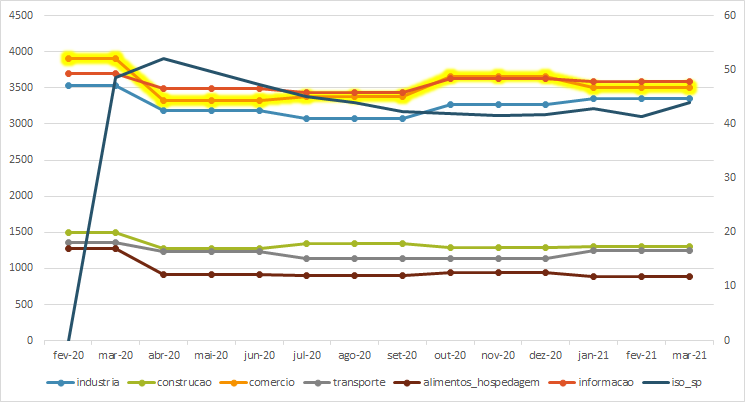

**Gráfico 9** - Variação do número de empregos em diferentes setores da economia do estado de São Paulo e o nível de isolamento social

Por ser o setor que apresentou maior correlação com o nível de isolamento do estado, percebe-se no gráfico que o número de empregos no comércio flutua segundo às alterações do isolamento. Nota-se também que apesar do comércio ser considerado a atividade econômica que mais emprega no estado (MATTEI e HEINEN,2020), após o início da pandemia apresentou importante queda e no primeiro trimestre de 2021, foi superado pelo setor da informação como atividade com maior número de pessoas empregadas. 

Pelo gráfico também é possível notar que o setor da alimentação e hospedagem apresentou uma grande queda já no início da pandemia, sendo um fato também constatado por Costa (2020) através da análise sobre as principais notícias sobre desemprego na pandemia. Cabe ressaltar que a recuperação deste setor não se mostrou tão próxima aos outros setores, principalmente pois esta é composta por um maior número de trabalhadores informais. Neste caso uma das hipóteses é de que vários comércios relacionados a este setor faliram já no início da pandemia e o mercado não apresentou demanda suficiente para reabertura de novos comércios e geração de novos empregos ao longo do ano. Além disso, este setor da economia continua sendo afetado pelas restrições de isolamento social vigentes (reduzindo a capacidade e horário destes estabelecimentos).

## CAGED por DRS vs. Isolamento por DRS

### Com correlação - Grande SP e RMC

A Tabela 5 apresenta os dados de correlação do número de admissões e saldo com a série de isolamento social para cada um dos DRSs do estado de São Paulo. Nesta tabela, pode-se perceber que nem todos os 17 DRSs apresentaram correlação entre isolamento social e empregabilidade (admissões e saldo). Tanto o estoque quanto as demissões não apresentaram correlação e por isso não estão apresentados na tabela.

**Tabela 5** - Correlação entre saldo e adminissões do CAGED com o isolamento social de cada distrito de saúde

| Região | ADM (R)| p      | SALDO (R)| p      |
|--------|--------|--------|----------|--------|
| DRS 1  | -0.81  | 0.0003 | -0.8     | 0.0006 |
| DRS 2  | -0.56  | 0.03   | -0.6     | 0.02   |
| DRS 3  | -0.45  | 0.1    | -0.16    | 0.57   |
| DRS 4  | -0.81  | 0.0004 | -0.82    | 0.0003 |
| DRS 5  | -0.63  | 0.01   | -0.81    | 0.0004 |
| DRS 6  | -0.63  | 0.01   | -0.74    | 0.002  |
| DRS 7  | -0.79  | 0.0007 | -0.81    | 0.0003 |
| DRS 8  | -0.18  | 0.52   | -0.12    | 0.65   |
| DRS 9  | -0.7   | 0.004  | -0.74    | 0.0022 |
| DRS 10 | -0.59  | 0.02   | -0.62    | 0.01   |
| DRS 11 | -0.62  | 0.017  | -0.61    | 0.01   |
| DRS 12 | -0.69  | 0.006  | -0.77    | 0.001  |
| DRS 13 | -0.47  | 0.08   | -0.38    | 0.16   |
| DRS 14 | -0.64  | 0.01   | -0.53    | 0.05   |
| DRS 15 | -0.72  | 0.003  | -0.63    | 0.01   |
| DRS 16 | -0.66  | 0.008  | -0.74    | 0.002  |
| DRS 17 | -0.83  | 0.0002 | -0.79    | 0.0006 |

Foi analisado, para cada DRS, a correlação entre isolamento social e os os dados de empregabilidade listados acima. Na Tabela 5 é possível observar que os DRSs que apresentam correlação moderada e forte entre empregabilidade (admissões e saldo) e isolamento social foram: DRS I (Grande São Paulo), DRS II (Araçatuba), DRS IV (Baixada Santista), DRS V (Barretos), DRS VI (Bauru), DRS VII (Campinas), DRS IX (Marília), DRS X (Piracicaba), DRS XI (Presidente Prudente), DRS XII (Registro), DRS XIV (São João da Boa Vista), DRS XV (São José do Rio Preto), DRS XVI (Sorocaba)  e DRS XVII (Taubaté). As correlações encontradas foram inversamente proporcionais, isto é, à medida que o isolamento social aumenta, a empregabilidade (admissões e saldo) diminui e vice-versa. Vale ressaltar que, apesar do saldo ser um dado diretamente relacionado tanto a admissões quanto a demissões, esses dados são independentes - empresas podem reduzir suas admissões mas não necessariamente precisam aumentar suas demissões. A partir das correlações encontradas é possível dizer que o isolamento social parece estar relacionado à empregabilidade da maioria dos municípios do estado de São Paulo, no entanto, correlação e causalidade são conceitos diferentes. Sabe-se que existem outras variáveis que afetam a empregabilidade e não foram abordadas neste trabalho.   

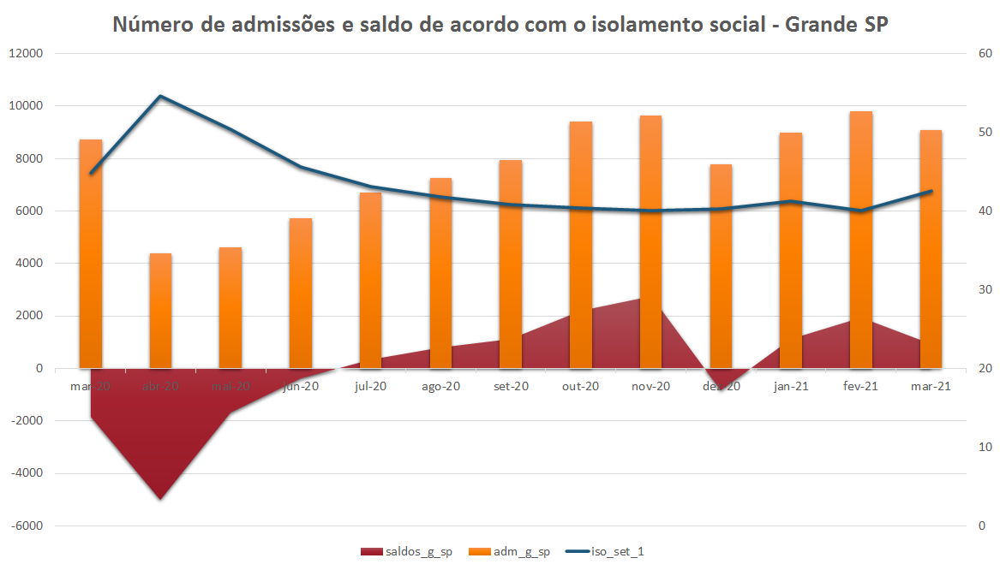

Gráfico 11: Saldo, admissões e isolamento social no DRS I - Grande São Paulo entre Março de 2020 a Março de 2021

Para o DRS I (Grande São Paulo) o Gráfico 11 apresenta que o início da pandemia (Março, Abril e Maio), foi o período em que o saldo (em vermelho no gráfico) apresentou os menores valores. À medida que o isolamento social diminuiu (linha azul) o saldo e as admissões (colunas) começaram a aumentar. Ressalta-se que há uma tendência histórica no aumento da contratação nos últimos meses do ano e uma tendência a aumento no número de demissões nos primeiros meses do ano. Essa tendência histórica está associada à maior demanda de alguns setores da economia no final do ano, aumentando a contratação neste período (PORTAL G1, 2019; AGÊNCIA BRASIL, 2020). 

A empregabilidade sofre a influência de diversos fatores e a pandemia trouxe uma redução significativa no poder de compra da população brasileira, o que leva a uma recessão econômica e isso pode influenciar a empregabilidade. Alguns setores da economia foram mais afetados pela pandemia da Covid-19 e entraram em recessão, no entanto, outros setores apresentaram expansão (BRASIL, 2020). Como já discutido acima nas análises por setores da economia. No DRS-I, Grande São Paulo,  a principal atividade econômica é o setor de serviços, o que pode explicar a correlação encontrada. Infelizmente, o CAGED não oferece, para cada um dos municípios do país, dados de empregabilidade associados aos setores da economia, o que limita análises a respeito.

Pelos dados do PNAD sabe-se que o isolamento social apresentou correlação significativa com a taxa de ocupados de setores da economia como comércio.Vale destacar que apesar  dos dados da PNAD e do CAGED avaliarem empregabilidade, eles seguem metodologias diferentes o que torna a comparação dos dados inadequada, no entanto, analisar a tendência parece uma estratégia válida (ALMEIDA et al, 2018). 

Outro ponto a se destacar e que foge às estatísticas do CAGED são os empregos informais e a jornada dupla de trabalho. São trabalhadores que atuam de maneira informal nestes setores da economia (serviços, alimentação, hospedagem) e que trabalham nestes setores para complementar ou adequar sua renda (orçamento). Ao perderem estes empregos perdem parte da renda o que pode afetar seu poder de compra. A concentração da população do DRS-I que trabalha nos setores de serviços, alimentação e hospedagem é elevada, o que explica, em parte, os resultados encontrados. Sabe-se que uma parcela significativa dos trabalhadores deste setor atuam de maneira informal, conforme discutido anteriormente. Ao se decretar medidas de isolamento social mais rígidas, os setores da economia citados anteriormente são os mais afetados e a contratação bem como o saldo dos municípios deste DRS são reduzidos.  

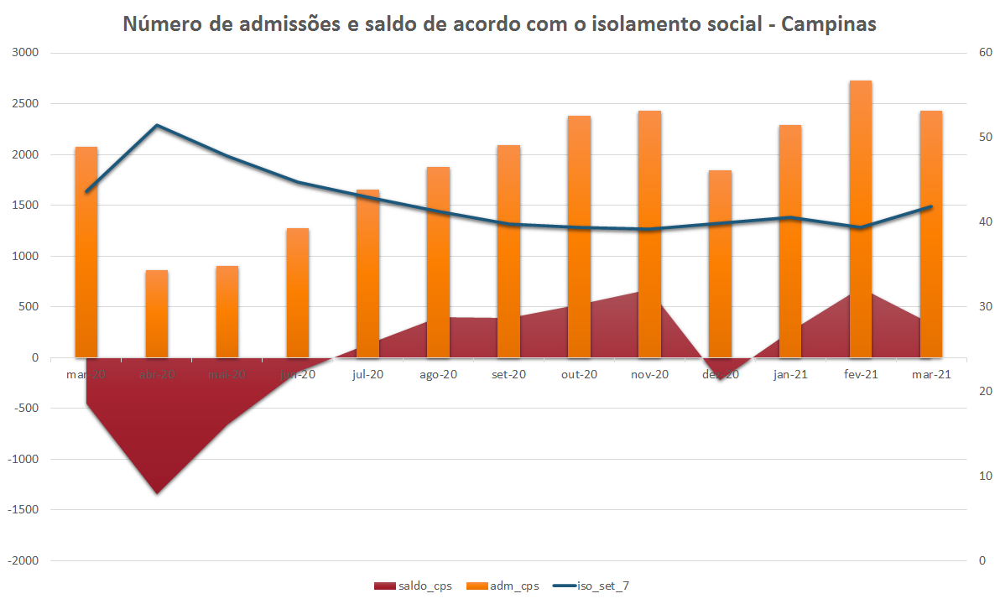

Gráfico 11: Saldo, admissões e isolamento social no DRS VII - Campinas entre Março de 2020 a Março de 2021

Assim como o DRS-I, o DRS - VII (Campinas), apresenta a mesma tendência (aumento do isolamento, redução da empregabilidade) observada no gráfico da Grande São Paulo. Campinas é o maior município do DRS-VII e o PIB é formado por mais de 90% dos setores de comércio e serviços.(CAMPINAS, s/d). O isolamento afeta diretamente tais setores, o que leva a uma redução da empregabilidade.

Os gráficos das demais DRS podem ser encontrados no [Anexo II](assets/pdf/ANEXO-II.pdf).

### Sem correlação

Analisando a tabela Tabela 5, nota-se que nem todas as DRS apresentaram correlação para as séries históricas de saldo e admissões quando analisadas com o isolamento praticado, como é o caso do DRS - III (Araraquara), DRS - VIII (Franca) e DRS-XIII (Ribeirão Preto). Em nosso ponto de vista, este comportamento para estas regiões pode estar relacionado com o tipo da atividade econômica predominante nas mesmas, que são atividades relacionadas ao agronegócio e à indústria (em especial para Franca). Também é notável, que estes são DRSs com médias de isolamento dentre as mais altas do estado.


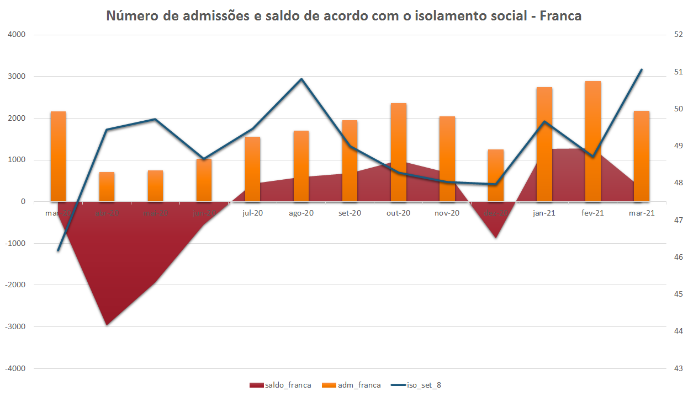

Gráfico 12: Saldo, admissões e isolamento social no DRS VIII - Franca entre Março de 2020 a Março de 2021.

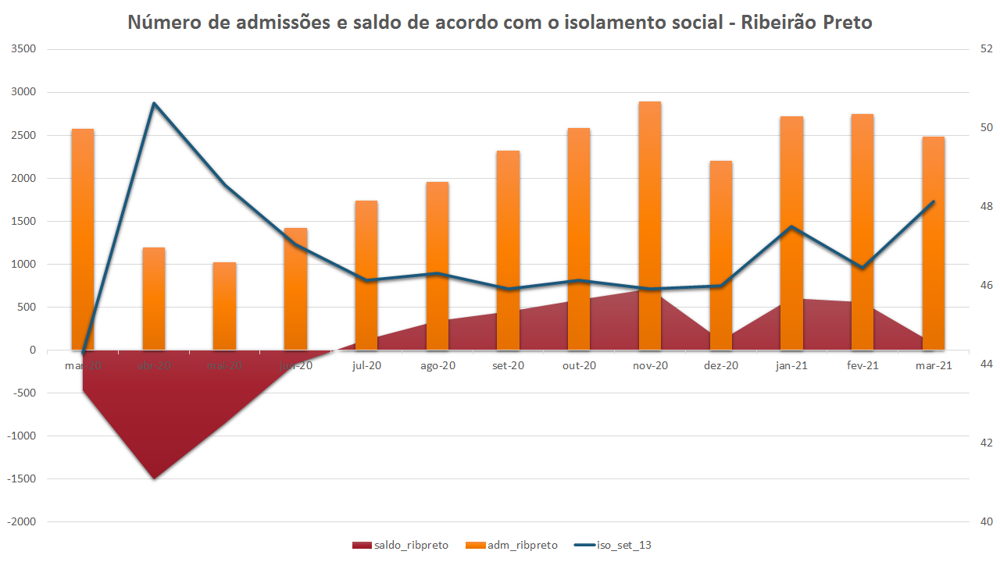

Gráfico 13: Saldo, admissões e isolamento social no DRS XIII - Ribeirão Preto entre Março de 2020 a Março de 2021.

Analisando os gráficos 12 e 13 apesar da não existência de correlação, ainda é possível verificar que estes DRSs apresentam padrões similares para as séries de saldo e admissões, com um cenário menos otimista nos primeiros meses acompanhado de uma leve melhora nos meses seguintes.

# Limitações do Estudo
Nosso estudo apresenta limitações que devem ser consideradas na avaliação de nossos resultados. A análise de associação aqui utilizada nos permite apenas a inferência de uma correlação entre isolamento social e empregabilidade no estado de SP, não sendo possível a avaliação de causa e efeito.

Além disso, cabe salientar alguns aspectos sobre as bases de dados utilizadas que podem afetar os dados coletados: a PNAD que antes era realizada de modo presencial, no ano de 2020, com a pandemia passou a ser feita de modo online, o que pode ter reduzido significativamente a participação dos entrevistados. O CAGED também apresentou mudanças importantes no ano de 2020, contabilizando também os empregos temporários e não apenas os definitivos, o que influenciou diretamente no número de empregos formais informados a partir deste ano. A base dados do IPT considera deslocamentos maiores que 200m como não cumprimento do isolamento social.

Também é necessário levar em consideração a crise econômica prévia que o país já passava, e importantes mudanças na CLT, gerando uma precarização do trabalho e que a pandemia apenas intensificou o processo. Neste caso, não é possível inferir até que ponto foi o isolamento social que influenciou na empregabilidade e até quanto a perda de empregos seria resultante da crise econômica dos últimos anos.

----
<p><small>Project based on the <a target="_blank" href="https://drivendata.github.io/cookiecutter-data-science/">cookiecutter data science project template</a>. #cookiecutterdatascience</small></p>
