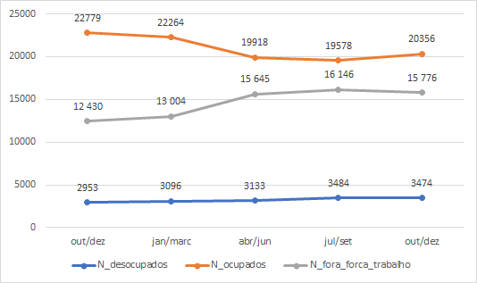
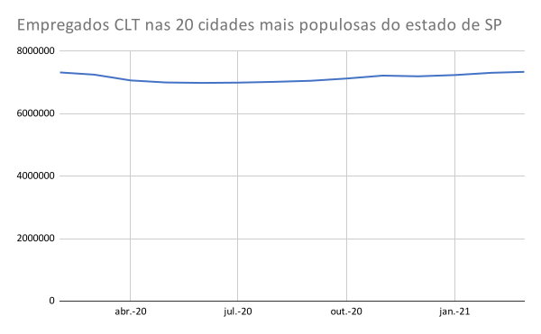

# Projeto _“Um estudo sobre a relação entre isolamento social e empregabilidade durante o período da pandemia da COVID-19 no estado de São Paulo”_

# Project _“A study on the relationship between social isolation and employability during the pandemic period of COVID-19 in São Paulo (Brazil)”_

# Apresentação

O presente projeto foi originado no contexto das atividades da disciplina de pós-graduação [Ciência e Visualização de Dados em Saúde](https://github.com/datasci4health/home), oferecida no primeiro semestre de 2021, na Unicamp.

## Integrantes

|              Nome             	|   RA   	|                        Especialização                        	|
|:-----------------------------:	|:------:	|:------------------------------------------------------------:	|
| Aline Liz de Faria            	| 226606 	| Nutricionista aluna especial                                 	|
| Carolina Neves Freiria        	| 101825 	| Nutricionista - Doutoranda em gerontologia FCM               	|
| Flavia Noeli de Souza Infante 	| 100061 	| Nutricionista - Doutoranda Saúde da Criança e do adolescente 	|
| Gustavo G. Plensack           	| 155662 	| Engenharia Elétrica - Aluno especial                         	|

# Disclaimer ⚠️
Como você deve ter notado pelas especializações dos integrantes, nós não somos especialistas em economia nem políticas de saúde pública. Este estudo foi conduzido no como um exercício de análise orientada a dados de uma disciplina do programa de pós-graduação da Unicamp e não deve ser usado para nada além deste propósito.

# Acompanhando a Evolução do Projeto
Com o intuito de simplificar a navegação pelas versões do projeto, foram criadas 3 tags, sendo elas E1, E2 e E3. Estas tags correspondem aos commits finais em cada uma das entregas. Para visualizar o trabalho nestes pontos da história, dar checkout nestas tags, como mostra o comando abaixo para a E1:

```sh
git checkout E1
```

Você também pode inspecionar as tags pelo seu navegador usando a seção de [tags](https://github.com/gustavoplensack/datasci4health/tags) do GitHub.


# Descrição Resumida do Projeto
A pandemia da COVID-19 é um acontecimento sem precedentes na história recente da humanidade e seus impactos chegaram a todos os setores da sociedade. Como forma de mitigar a crise sanitária, uma das medidas mais eficazes se mostrou ser o distanciamento social.

Esta prática, necessária para conter os números de casos da COVID-19 pode desencadear mudanças sobre a economia, em especial em países emergentes como o Brasil. Este estudo se propõe a investigar as relações entre o isolamento social praticado no estado de São Paulo, através dos dados do Instituto de Pesquisas Tecnológicas (IPT), e a empregabilidade, através dos dados da  Pesquisa Nacional por Amostra de Domicílios (PNAD) e Cadastro Nacional de Empregados (CAGED).

A análise das séries referentes à empregabilidade no país evidenciou importantes modificações ao longo da pandemia, sendo que o aumento do isolamento correlacionou-se com a redução da empregabilidade. Ressalta-se que apesar da presença de correlação entre empregabilidade e isolamento social, a estatística adotada em nosso estudo não nos permite inferências sobre causa e efeito. O fenômeno da pandemia e empregabilidade é multidimensional e futuras análises devem incorporar  possíveis efeitos mediadores nesta situação como nível de ocupação de UTIs, recebimento de auxílio emergencial e índices econômicos.

**O isolamento social é, e segue sendo, uma das principais formas de reduzir a circulação do vírus e salvar vidas.**


# Vídeos do Projeto
## Vídeo da Proposta
🎥 [Proposta](https://drive.google.com/file/d/1r17x60hF7Gx_e8v6M-6V-O7QfEi8iRQL/view)

## Vídeo da Apresentação Final
🎥 [TBD](tbd)

# Slides do Projeto
## Slides da Proposta
[Proposta do Projeto - CX002A/IA368X](https://docs.google.com/document/d/17sgFU_VSk_p8cTdW3BPgF-Q1Tbr7KLM4GlUjHscx184/edit?usp=sharing) 

## Slides da Apresentação Final
[Apresentação final - CX002A/IA368X](https://docs.google.com/presentation/d/1KfwHWIPRDmZvLer-tZGSdh2pJMqdxvl_slKtDLJ1BuE/edit#slide=id.gb6e7b4d16d_3_21)

# Introdução e Referenciais Teóricos
A pandemia da COVID-19 é um acontecimento sem precedentes na história recente da humanidade e seus impactos chegaram a todos os setores da sociedade. Como forma de mitigar a crise sanitária, uma das medidas mais eficazes se mostrou ser o distanciamento social (de SOUZA, 2020).

Esta prática, necessária para conter os números de casos da COVID-19 pode desencadear mudanças sobre a economia, em especial em países emergentes como o Brasil devido à limitação de circulação de pessoas (MUNIZ, SILVA, FERNANDES, 2020).

A instabilidade na saúde causada pela pandemia da Covid-19, doença causada pelo novo Coronavírus (SARS-CoV-2), acentuou as vulnerabilidades do nosso sistema social econômico, em um país de larga extensão territorial com diversos cenários econômicos como é o Brasil (MUNIZ, SILVA, FERNANDES, 2020).

A primeira notificação de Covid-19 ocorreu em 25 de fevereiro de 2020. Em março do mesmo ano, o país adotou as normas de distanciamento social (quarentena), afetando setores da economia, em especial alimentação, hospedagem e comércio (COSTA, 2020).

Neste contexto, o presente estudo propõe investigar as relações entre o isolamento social praticado no estado de São Paulo e a empregabilidade, através dos dados do IPT, da PNAD e CAGED.

A relevância de verificar tais relações, permite vislumbrar a necessidade de ações para impulsionar o setor econômico  pós pandemia,  como empregabilidade, incentivos fiscais e trabalhistas, assim como medidas de incentivo do setor privado através de linhas de crédito e medidas de incentivo ao consumo.

A motivação do desenvolvimento deste estudo, iniciou-se a partir  da observação da grande demanda dos canais de comunicação em anunciar enfrentamentos no setor de trabalho, como altas taxas de desemprego, aumento da pobreza, e medidas governamentais para conter a crise sanitária e redução dos impactos na economia do país.

No campo científico, alguns autores abordam a questão dos índices de empregabilidade no contexto da pandemia (COSTA, 2020, MUNIZ, SILVA, FERNANDES, 2020). Costa, (2020) relata que fatores anteriores à crise sanitária, como redução do investimento público em programas sociais, e as mudanças na Consolidação das Leis Trabalhistas (CLT) podem ter influenciado os números de desemprego no país.

Nosso estudo se baseou na análise de correlações entre as séries históricas dos dados de empregabilidade e isolamento para o estado de São Paulo. Para isso foram construídos bancos de dados a partir dos dados públicos disponibilizados pelo IPT, Ministério da Economia - Secretaria do Trabalho (ME-ST) e Instituto Brasileiro de Geografia Estatística (IBGE).

Foi encontrado correlação inversamente proporcional do número de ocupados com o isolamento para o estado. Também foi encontrado correlação inversamente proporcional entre os setores da economia e o isolamento praticado no estado. Apesar dos dados gerais do CAGED para o estado não possuírem correlação, a maioria apresentou correlação para o número de admissões e saldo dos Departamentos Regionais de Saúde (DRSs).

# Perguntas de Pesquisa

Qual a relação entre isolamento social e empregabilidade (PNAD e CAGED) durante a pandemia da COVID-19 no estado de São Paulo?

## Hipóteses

**H1:** existe correlação entre isolamento social e empregabilidade no estado de São Paulo.

# Objetivos do Projeto
Investigar as relações entre o isolamento social praticado no estado de São Paulo e a empregabilidade no primeiro ano da pandemia.

## Objetivos Secundários
* Analisar o isolamento social no estado de São Paulo e em seus Departamentos Regionais de Saúde (DRS) entre março de 2020 a março de 2021.
* Analisar as séries históricas do CAGED e PNAD ao longo do primeiro ano da pandemia;
* Analisar a correlação entre entre o isolamento praticado no estado e os diversos setores da atividade econômica representados na PNAD;
* Analisar a correlação entre o isolamento praticado nos DRSs e o CAGED;

# Metodologia
O projeto de pesquisa utilizou o modelo KDDM seguindo a metodologia de Fayyad et al, 1996 dividida em 9 passos:
1. Desenvolvimento do projeto e entendimento do problema; 
2. Criação de conjunto de dados alvo;
3. Limpeza dos dados e Pré-processamento;
4. Redução dos dados e Projeções;
5. Escolha da tarefa de mineração de dados;
6. Escolha do algoritmo para análise dos dados;
7. Mineração dos dados;
8. Interpretação dos dados;
9. Consolidação do conhecimento;

Através destes 9 passos, buscamos estudar como as séries históricas de empregabilidade mensuradas pela CAGED e PNAD Contínua se correlacionam com os dados do isolamento social mensurados pelo IPT para o estado de São Paulo.

A análise dos dados foi baseada na exploração visual das séries, em conjunto com o estudo da correlação usando o método de Spearman, devido à não normalidade das séries. Os detalhes estão na seção análises realizadas.

# Bases de Dados e Evolução

## Bases de Estudadas mas Não Adotadas

### Mapa brasileiro da COVID-19 - InLoco

|             Base de Dados            |                 Endereço na Web                 |                                      Resumo descritivo                                     |
|:------------------------------------:|:-----------------------------------------------:|:------------------------------------------------------------------------------------------:|
| Mapa brasileiro da COVID-19 - InLoco | https://mapabrasileirodacovid.inloco.com.br/pt/ | Dados de abrangência nacional sobre isolamento social coletado através de apps de celular. |

A InLoco é uma startup de Recife especialista em geolocalização (atuante desde 2011). Para criar o “Índice de isolamento social” a Inloco utilizou dados celulares de 60 milhões de usuários. Por meio da API (Application Programming Interface) de aproximadamente 600 aplicativos (desde aplicativos de bancos até lojas de varejo) parceiros da empresa que anonimiza e agrega os dados e então repassa aos estados parceiros. A InLoco coletava, até então, estes dados de geolocalização para fins de publicidade e prevenção de fraudes. Durante a pandemia estes dados foram utilizados para avaliar o isolamento social.

A empresa calcula a taxa de isolamento a partir de um espaço que é dividido em polígonos de 450 metros de raio. A taxa de isolamento mede, do total de aparelhos que estavam no polígono durante a noite, quantos não mudaram de polígono ao longo do dia. A taxa de precisão é de 3 metros.

Para essa análise ser estatisticamente relevante, são disponibilizados os dados de isolamento apenas no caso de haver um número mínimo de 20 usuários observados dentro das microrregiões. Se um município não tiver nenhuma microrregião que atenda a esse filtro, ele é desconsiderado e será eliminado na composição do Índice de Isolamento do Estado.

Durante o segundo semestre de 2020, a empresa InLoco foi vendida para a rede Magazine Luiza e a coleta de dados foi descontinuada no início de 2021. Os dados coletados durante o ano de 2020 e início de 2021 ficarão disponíveis no Tableau Public. Foram coletados dados durante o período de fevereiro de 2020 até março de 2021.

Após a reunião com a professora Thaís na E1 o grupo acatou a sugestão de trabalhar com dados em menores proporções e limitamos o trabalho ao estado de São Paulo, o que nos permitiu descartar este conjunto de dados. Outros motivos para não escolhermos os dados do Inloco foi a descontinuidade da coleta a partir do final de março de 2021 e o fato de terem sido coletados por meio de apps específicos, o que pode enviesar as análises, uma vez que estaríamos considerando apenas o isolamento dos usuários de alguns apps.

### Pesquisa Nacional de Amostras de Domicílios - PNAD COVID-19

| Base de Dados |                                                                                            Endereço na WEB                                                                                            |                                       Resumo Descritivo                                       |
|:-------------:|:-----------------------------------------------------------------------------------------------------------------------------------------------------------------------------------------------------:|:---------------------------------------------------------------------------------------------:|
|   PNAD COVID-19  | https://www.ibge.gov.br/estatisticas/investigacoes-experimentais/estatisticas-experimentais/27946-divulgacao-semanal-pnadcovid1?t=o-que-e&utm_source=covid19&utm_medium=hotsite&utm_campaign=covid_19 | Dados de abrangência nacional com entrevistas realizadas pelo telefone com 193 mil domicílios |

Durante a pandemia também foi lançada a PNAD COVID-19 que acompanhou 193,6 mil domicílios em 3.364 municípios do país com o objetivo de avaliar os impactos da pandemia no mercado de trabalho.

Era composta por um questionário dividido em duas partes: a primeira composta por perguntas sobre saúde, especificamente sobre sintomas relacionados a COVID19 e a segunda parte sobre trabalho e se houve recebimento de auxílios por parte do governo, como auxílio emergencial, bolsa família, seguro desemprego, benefício de prestação continuada (BPC), lei orgânica da previdência social (LOAS) e aluguel.

Teve seu início em maio de 2020 e foi descontinuada em setembro do mesmo ano. Por este motivo, visando atender aos objetivos estabelecidos neste projeto de pesquisa, optou-se pela análise apenas da PNAD contínua que abrange um período maior de estudo. Além disso, a PNAD covid-19, segundo o próprio IBGE, pode fornecer estatísticas experimentais na quais as inferências realizadas a partir dos dados devem ser realizadas com maior cautela (IBGE, s/d).


## Bases Estudadas e Adotadas

### Dados de Isolamento Social do Estado de São Paulo - IPT

|                      Base de Dados                      |                    Endereço na Web                    |                                  Resumo descritivo                                 |
|:-------------------------------------------------------:|:-----------------------------------------------------:|:----------------------------------------------------------------------------------:|
| Dados de Isolamento Social do Estado de São Paulo - IPT | https://www.saopaulo.sp.gov.br/coronavirus/isolamento | Dados sobre o isolamento social em cidades paulistas com mais de 50 mil habitantes |

O IPT juntamente com o SIMI-SP (Sistema de Informações e Monitoramento Inteligente do Governo do Estado de São Paulo) divulga, diariamente, dados sobre o isolamento social nas cidades do estado de São Paulo. Os dados sobre isolamento social são coletados a partir de empresas prestadoras de serviços de telecomunicação (telefonia celular – VIVO, TIM, CLARO, OI). Tais dados são obtidos a partir de uma plataforma chamada Big Data que é gerida pela Associação Brasileira de Recursos em Telecomunicações (ABR Telecom).

O índice de isolamento social é baseado na localização obtida pelas antenas de celulares, usando como local de referência a localização onde o celular permaneceu entre 22h00 e 2h00. Um celular que tenha se afastado desta referência, mais de 200m, é considerado fora do isolamento.

Os dados são repassados de forma anônima e agregada índices, gráficos e mapas estaduais agregados por municípios, não existindo a possibilidade de acesso a qualquer dado individualizado por parte do IPT ou do Governo do Estado.

No início da coleta dos dados (início da pandemia) eram repassados apenas dados de municípios que possuíam mais de 70.000 habitantes, no entanto, a partir de janeiro de 2021 foram incluídos municípios com mais de 50.000 habitantes. Os índices são disponibilizados de maneira pública no [site do estado](http://saopaulo.sp.gov.br/coronavirus/isolamento) e são atualizados diariamente.

O esquema do banco é uma série temporal com o isolamento naquele dia para um dado município. Também são encontrados alguns metadados como a população em 2020 e código do IBGE.

Os dados divulgados pelo IPT apresentavam alguns pouquíssimos dados faltantes nos primeiros dias de análises (fevereiro e março) para alguns municípios usados na elaboração do banco de dados sobre isolamento social. Para as análises propostas, foram realizadas médias para avaliar as correlações e eles foram ignorados.

Uma análise inicial sobre estes dados permitiu notar que para as 20 cidades mais populosas do estado a série de isolamento apresenta uma alta correlação. Ao longo de todo o período, o isolamento ficou entre 30% e 50% sendo um pouco maior nos finais de semana. Detalhes, gráficos e código podem ser verificados em [notebooks/Estudo_IPT_E2.ipynb](https://github.com/gustavoplensack/datasci4health/blob/main/notebooks/Estudo_IPT_E2.ipynb)
 
Entendemos estes dados como sendo melhores do que os dados do InLoco, devido ao fato de estes serem associados a todos os usuários de dispositivos móveis que se locomoveram, sendo assim menos restrito ao tipo de usuário.

### PNAD contínua - Macrodados

|          Base de Dados          |                                                                      Endereço na Web                                                                      |                                                       Resumo descritivo                                                      |
|:-------------------------------:|:---------------------------------------------------------------------------------------------------------------------------------------------------------:|:----------------------------------------------------------------------------------------------------------------------------:|
| Macrodados PNAD Contínua - IBGE | https://www.ibge.gov.br/estatisticas/sociais/trabalho/9173-pesquisa-nacional-por-amostra-de-domicilios-continua-trimestral.html?edicao=30227&t=resultados | Acompanhamento do desenvolvimento socioeconômico do país, apresentando dados referente a força de trabalho formal e informal |

A Pesquisa Nacional por Amostras de Domicílios (PNAD) em sua forma contínua teve início em 2012 com a junção da PNAD antiga e a Pesquisa Mensal de Emprego (PME) sendo realizada pelo Instituto Brasileiro de Geografia e Estatística (IBGE). A pesquisa tem abrangência nacional possibilitando inferências sobre o país, grandes regiões, unidades da federação e de algumas regiões metropolitanas dos municípios das capitais (SULIANO, 2017; IBGE, s/da).

O grande foco da PNAD é o acompanhamento do desenvolvimento socioeconômico do país, apresentando dados referente a força de trabalho tanto formal como informal de forma mensal (país) e trimestral (demais subdivisões), contemplando outras informações relevantes de forma anual, sendo para tanto considerada uma das principais pesquisas sobre o mercado de trabalho do Brasil (SULIANO, 2017; IBGE, s/da; CONSEUIL, et al., 2019). 

A pesquisa é realizada em 3.500 municípios do Brasil, acompanhando em média 211.344 domicílios particulares permanentes, na qual, cada um dos domicílios é visitado por 5 trimestres consecutivos. Durante o período da pandemia pelo coronavírus as entrevistas estão sendo realizadas via telefone (início na terceira semana de referência do mês de março de 2020) (SULIANO, 2017; IBGE, s/da; IPEA, 2019).

O acesso ao banco de dados é aberto e fica localizado no próprio site do IBGE. No site é possível o acesso rápido às informações mensais do país e aos dados trimestrais das regiões e unidades da federação. Para as análises referentes às regiões metropolitanas dos municípios das capitais é necessário o acesso aos microdados da pesquisa (IBGE, s/da).

Durante a pandemia também foi lançada a PNAD COVID-19 que acompanhou 193,6 mil domicílios em 3.364 municípios do país com o objetivo de avaliar os impactos da pandemia no mercado de trabalho. Teve seu início em maio de 2020 e foi descontinuada em setembro do mesmo ano. Por este motivo, visando atender aos objetivos estabelecidos neste projeto de pesquisa, optou-se pela análise apenas da PNAD contínua que abrange um período maior de estudo. Além disso, a PNAD covid-19, segundo o próprio IBGE, pode fornecer estatísticas experimentais na quais as inferências realizadas a partir dos dados devem ser realizadas com maior cautela (IBGE, s/db). 
 
**Sobre os dados utilizados da PNAD contínua**

Após a primeira arguição de nosso projeto com a professora Thaís, optou-se por focar apenas no banco de dados referente ao estado de São Paulo. Pelo site do IBGE foi possível baixar o banco de dados brutos do estado, com 112 tabelas contendo informações sobre a população geral, força de trabalho e  rendimentos obtidos entre o período de janeiro de 2012 a dezembro de 2020. 

Inicialmente foi realizado um recorte temporal do banco, considerando o último trimestre pré-pandemia (outubro/dezembro 2019) e o período referente a pandemia de covid-19 no país (considerando os trimestres de janeiro/março a outubro/dezembro de 2020). Após, foram coletadas as informações referentes a população total; população com mais de 14 anos de idade; pessoas de 14 anos ou mais de idade ocupadas; pessoas de 14 anos ou mais de idade desocupadas e pessoas de 14 anos ou mais de idade fora da força de trabalho. A seleção destas informações foi realizada para o estabelecimento de um panorama acerca da situação de pessoas empregadas, desempregadas e que estavam fora da força de trabalho (não estavam em busca de emprego) durante o período da pandemia.

**Análise descritiva dos dados**

Durante o período selecionado a pesquisa contou com uma média de população total de 46 mil pessoas, sendo que destas, aproximadamente 38,5 mil apresentavam 14 anos ou mais de idade. O gráfico abaixo contém as informações sobre a população de pessoas de 14 anos ou mais de idade ocupadas, desocupadas e fora da força de trabalho no estado de São Paulo entre o período analisado.



Gráfico 1 - Evolução do número de pessoas desocupadas, ocupadas e fora da força de trabalho no estado de São Paulo de outubro de 2019 a dezembro de 2020. 


Podemos perceber pelo gráfico que entre o primeiro e segundo trimestre houve uma leve redução no número de pessoas ocupadas no estado, sendo a queda mais acentuada observada entre o segundo e terceiro trimestre, esboçando uma recuperação apenas entre o quarto e quinto trimestre. Em contraste, o nível de desocupados apresentou-se de maneira inversa: com grande aumento entre o segundo e terceiro trimestre, um aumento menos acentuado entre o terceiro  e quarto trimestre e uma leve queda entre o quarto e último trimestre.

Por fim, o nível de pessoas fora da força de trabalho manteve-se estável ao longo do período acompanhado, apresentando um leve aumento durante os três últimos trimestres, o que poderia ser um reflexo da diminuição de pessoas procurando emprego com receio da pandemia. 

Não foi necessário lidar com dados faltantes.

### CAGED - ME-ST
| Base de Dados |                       Endereço na Web                       |                            Resumo descritivo                            |
|:-------------:|:-----------------------------------------------------------:|:-----------------------------------------------------------------------:|
| CAGED - ME-ST | https://www.gov.br/trabalho/pt-br/assuntos/empregador/caged | Dados sobre empregados contratados e demitidos seguindo o regime da CLT |

O Cadastro Geral de Empregados e Desempregados (Caged), é um Registro Administrativo, derivado do cumprimento de obrigação trabalhista definida pela Lei nº 4.923, de 23 de dezembro de 1965, de periodicidade mensal, cujo objetivo é monitorar a evolução do mercado de trabalho formal. Os dados estatísticos do Caged são obtidos a partir de declarações enviadas mensalmente pelos estabelecimentos, que dizem respeito à movimentação de empregados ao longo do mês (MINISTÉRIO da ECONOMIA, 2020).

A declaração do Caged é obrigatória para todo estabelecimento, privado ou público, que tenha admitido, desligado ou transferido empregado com contrato de trabalho regido pela Consolidação das Leis do Trabalho (CLT). Seu universo de abrangência  limita-se aos empregados formais celetistas, incluindo contratos de trabalho com prazo indeterminado e determinado, aprendizes, trabalhadores intermitentes, por tempo parcial e temporários (para estes últimos, a declaração é opcional). Não estão incluídos no Caged servidores da administração pública direta ou indireta, federal, estadual ou municipal, trabalhadores, autônomos e trabalhadores informais (MINISTÉRIO da ECONOMIA, 2020).

Originalmente criado para fins operacionais, o Caged constitui hoje uma das principais fontes de informações estatísticas sobre o mercado de trabalho conjuntural formal, sendo amplamente utilizado por órgãos governamentais, centros de pesquisa, consultorias privadas e academia. Sua base de dados inclui informações sobre os vínculos formais, informações individuais dos trabalhadores, além de características dos estabelecimentos, sendo a única fonte de informação sobre emprego formal mensal.  (MINISTÉRIO da ECONOMIA, 2020)

Após arguição com a professora Thaís o grupo, preferiu investigar dados  menores,  e limitamos o trabalho ao estado de São Paulo, para isso, foi selecionado as 20 cidades mais populosas do estado, concomitante às mesmas selecionadas pelos dados ofertados do IPT. Os dados do CAGED estão disponíveis de forma pública no endereço: https://www.gov.br/trabalho/pt-br/assuntos/empregador/caged. Foi realizada uma análise em conjunto com o grupo de alunos para compreender os dados da planilha, a partir deste entendimento, optou-se em utilizar os dados de estoque que significa o número de trabalhadores formais por cidade selecionada.

Como pode ser observado no gráfico 2 a série histórica aproximadamente constante para estas 20 cidades (total de empregados no regime CLT) ao longo do ano de 2020. No entanto, como apontado na reportagem do Jornal Nacional entitulada: "[Pesquisas sobre nível de emprego podem ter deixado de apresentar retrato preciso do mercado de trabalho, dizem especialistas](https://globoplay.globo.com/v/9479568/)", os dados do CAGED podem ter deixado de refletir a situação do desemprego em conjunto com a PNAD.



# Metodologia
O projeto de pesquisa usará o modelo _KDDM_ seguindo a metodologia de (FAYYAD,1996) dividida em 9 passos:

1. Desenvolvimento do projeto e entendimento do problema; 
2. Criação de conjunto de dados alvo;
3. Limpeza dos dados e Pré-processamento;
4. Redução dos dados e Projeções;
5. Escolha da tarefa de mineração de dados;
6. Escolha do algoritmo para análise dos dados;
7. Mineração dos dados;
8. Interpretação dos dados;
9. Consolidação do conhecimento;

Para execução desta metodologia, esperamos empregar as seguintes técnicas de mineração de dados: análises estatísticas, análise de redes, técnicas de regressão e classificação.

# Ferramentas

As ferramentas que serão utilizadas dentro deste projeto serão:
* Python 3.6.9
    * [Pandas](https://pandas.pydata.org/);
    * [Numpy](https://numpy.org/);
    * [Scikit-learn](https://scikit-learn.org/stable/);
    * [Statsmodels](https://www.statsmodels.org/stable/index.html);
    * [Seaborn](https://seaborn.pydata.org/);
    * [Matplotlib](https://matplotlib.org/stable/users/installing.html);
    * [Pillow](https://pillow.readthedocs.io/en/stable/)
* Gerenciamento de planilhas:
    * MS Excel e Google Sheets;
* Armazenagem e Computação em Nuvem:
    * Google Drive;
    * Google Colab;

# Cronograma
|                           -                           	|  Abril 	||  Maio  	||  Junho 	||  Julho 	|
|:-----------------------------------------------------:	|:------:	|:------:	|:------:	|:------:	|:------:	|:------:	|:------:	|
|                       Atividade                       	| 1 qui. 	| 2 qui. 	| 1 qui. 	| 2 qui. 	| 1 qui. 	| 2 qui. 	| 1 qui. 	|
| Plano de projeto                                      	|    X   	|        	|        	|        	|        	|        	|        	|
| Desenvolvimento do projeto e entendimento do problema 	|    X   	|    X   	|    X   	|        	|        	|        	|        	|
| Criação de conjunto de dados alvo                     	|    X   	|    X   	|    X   	|        	|        	|        	|        	|
| Limpeza dos dados e Pré-processamento                 	|    X   	|    X   	|    X   	|        	|        	|        	|        	|
| Base de Dados de Trabalho                             	|        	|        	|    X   	|        	|        	|        	|        	|
| Escolha da tarefa de mineração de dados               	|        	|        	|    X   	|    X   	|    X   	|        	|        	|
| Escolha do algoritmo para análise dos dados           	|        	|        	|    X   	|    X   	|    X   	|        	|        	|
| Mineração dos dados                                   	|        	|        	|    X   	|    X   	|    X   	|        	|        	|
| Interpretação dos dados                               	|        	|        	|        	|        	|    X   	|    X   	|        	|
| Consolidação do conhecimento                          	|        	|        	|        	|        	|        	|    X   	|        	|
| Entrega Final                                         	|        	|        	|        	|        	|        	|    X   	|        	|
| Apresentações                                         	|        	|        	|        	|        	|        	|    X   	|    X   	|

# Referências Acadêmicas
Fayyad, U., Piatetsky-Shapiro, G., & Smyth, P. (1996). From Data Mining to Knowledge Discovery in Databases. AI Magazine, 17(3), 37. https://doi.org/10.1609/aimag.v17i3.1230

Suliano D. Caracterização das Pesquisas Domiciliares com Ênfase na PNAD Contínua. Ceará; 2017. 

Instituto Brasileiro de Geografia e Estatística (IBGE). O IBGE apoiando o combate a COVID-19 [Internet]. [cited 2021 May 5]. Available from: https://covid19.ibge.gov.br/pnad-covid/

Instituto Brasileiro de Geografia e Estatística. Pesquisa Nacional por Amostra de Domicílios Contínua - PNAD Contínua [Internet]. [cited 2021 May 5]. Available from: https://www.ibge.gov.br/estatisticas/sociais/trabalho/17270-pnad-continua.html?=&t=o-que-e
Instituto de Pesquisa Econômica Aplicada. Ministério do Trabalho. Mercado de trabalho: conjuntura e análise. Brasília; 2019. 

Corseuil CHL, Ramos L, Azevedo B de S, Russo FM. Mais sobre as diferenças na evolução do emprego formal na PNAD contínua e no CAGED. 2019. 

Ministério da Economia. Nota Técnica: Substituição da captação dos dados do Caged pelo eSocial. 2020. Disponível em: http://pdet.mte.gov.br/o-que-e-novo-caged.


----
<p><small>Project based on the <a target="_blank" href="https://drivendata.github.io/cookiecutter-data-science/">cookiecutter data science project template</a>. #cookiecutterdatascience</small></p>
