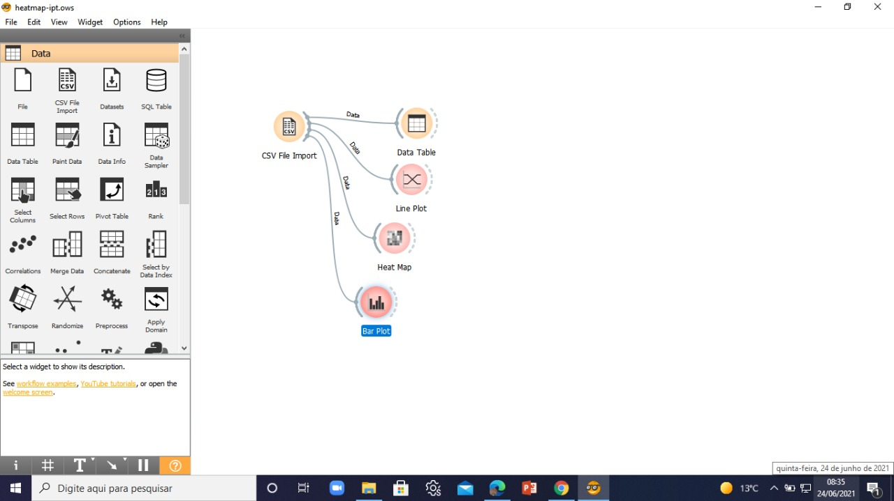

# Workflow Orange do projeto "Um estudo sobre a relação entre isolamento social e empregabilidade  durante o período da pandemia da COVID-19 no Estado de São Paulo."

## Tecnologias usadas

Uso do [Orange](https://orangedatamining.com/) para análises de mineração de dados.

O workflow deve se parecer com:

Para reproduzir estas análises use os dados contidos na pasta `<repo_root>/data/processed/heatmap-ipt.csv`.